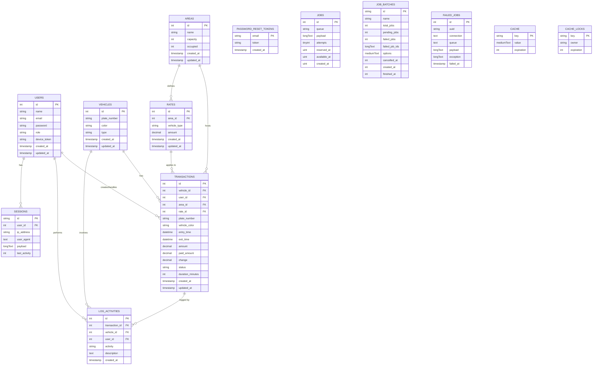

# Parqeer Database ERD

This file contains Entity Relationship Diagrams (ERD) for the Parqeer parking system and short descriptions of tables and relationships.

## Mermaid ERD (Overview)

---

## Notes on tables and relationships

- `users`:
  - Stores system accounts (roles: attendant, admin, owner).
  - `device_token` used for push notifications.
  - Related tables (via `user_id`): `transactions`, `log_activities`, `sessions`.

- **System support tables** (jobs, cache, sessions, password resets) are part of Laravel infrastructure and do not have business logic relationships. They are included here for completeness.

- `password_reset_tokens`:
  - One-time tokens for password reset flows.
  - `email` is primary key.

- `sessions`:
  - Used by Laravel to store session state; links optionally to `users` via `user_id`.

- `jobs`, `job_batches`, `failed_jobs`:
  - Queued job tables generated by Laravel for background processing.
  - `jobs` contains queued payloads; `job_batches` tracks batches; `failed_jobs` records failures.
  - No foreign key relationships with business tables.

- `cache`, `cache_locks`:
  - Key-value storage for caching and locking respectively.
  - Keys are primary strings; unrelated to domain tables.

- `vehicles`:
  - `owner_id` references `users.id` (optional; vehicles may be anonymous).
  - `plate_number` should be unique (enforced at DB/application level).

- `areas`:
  - Parking areas (e.g., Basement 1, Lot A) with `capacity` and `occupied` count.
  - `updateOccupancy()` should maintain `occupied` value atomically.

- `rates`:
  - Each `rate` belongs to an `area` and is scoped by `vehicle_type` (car, motorcycle, etc.).
  - `amount` is the per-hour (or defined period) fee used to compute `transactions.amount`.
  - Filtering revenue by vehicle type is implemented by joining `transactions` → `rates.vehicle_type` or via `transactions.vehicle_id` -> `vehicles.type`.

- `transactions`:
  - Core parking record: entry/exit times, computed `amount`, payment fields.
  - `status` enum values: `in`, `out`, `paid`, `unpaid`, etc.
  - `plate_number` and `vehicle_color` are duplicated for denormalization/audit (store a snapshot).
  - Includes `user_id` foreign key to `users` (attendant who processed entry/exit); this allows owner reports to segment revenue by attendant or user role.

- `log_activities`:
  - Audit trail for entry/exit/payment and admin actions.
  - Links to `transactions`, `vehicles`, and `users` where available.

## Cardinality summary

- One `user` can create/handle many `transactions` (1 → N).  
  *Owner reports often aggregate by attendant via this link.*
- One `vehicle` may have many `transactions` over time (1 → N).
- One `area` contains many `transactions` (1 → N) and many `rates` (1 → N).
- One `rate` may be applied to many `transactions` (1 → N).
- One `transaction` can produce many `log_activities` (1 → N).
- One `user` can own many `vehicles` (1 → N).

## Visual preview / export tips

- To preview the Mermaid ERD, open `ERD.md` in VS Code with a Mermaid preview extension (e.g., "Markdown Preview Enhanced" or GitHub's built-in preview if it supports mermaid). 
- To export as PNG/SVG, use a Mermaid live editor (https://mermaid.live) or VS Code Mermaid preview -> export.

---

File generated: March 2, 2026
