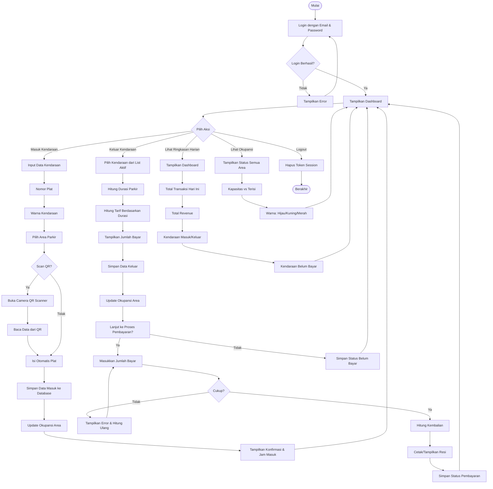
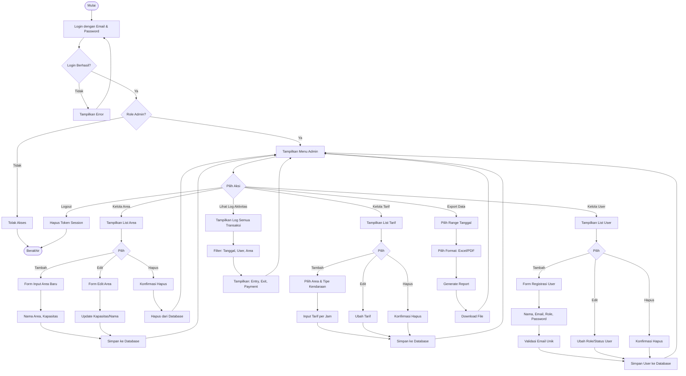
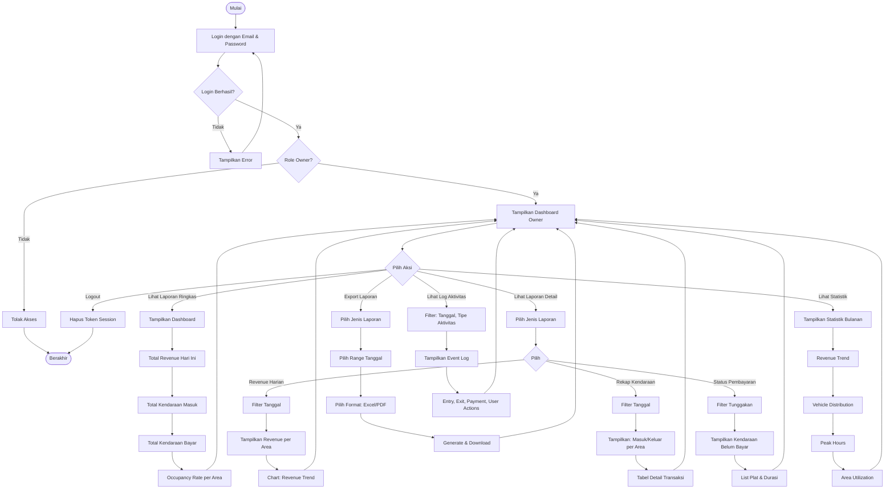
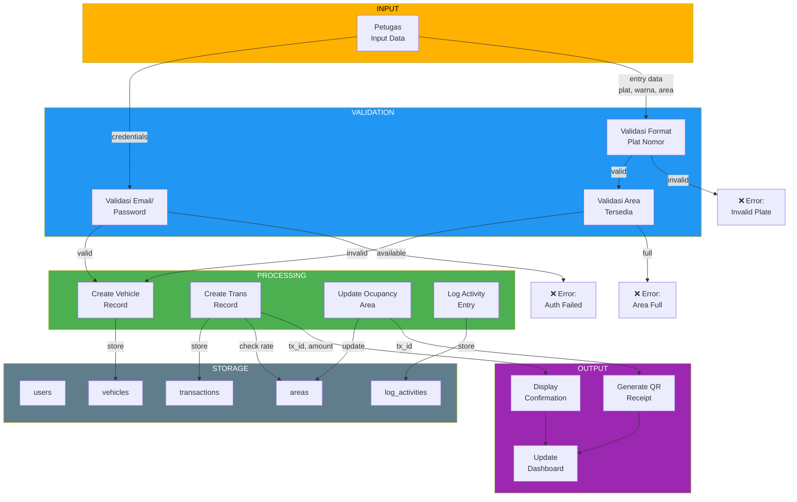

# Parqeer Parking System - Flowcharts & DFD

## 🎯 Flowchart Petugas (Attendant)



---

## 🔧 Flowchart Admin



---

## 👔 Flowchart Owner



---

## 📊 DFD Level 0 (Context Diagram)

```mermaid
graph TB
    subgraph External_Entities["EXTERNAL ENTITIES"]
        E1["👤 Petugas<br/>(Attendant)"]
        E2["👨‍💼 Admin"]
        E3["👨‍💻 Owner"]
        E4["🚗 Vehicle Owner"]
    end
    
    subgraph System["⭐ PARKING MANAGEMENT SYSTEM"]
        S["Parqeer<br/>Parking<br/>System"]
    end
    
    subgraph Data_Store["🗄️ DATA STORE"]
        DB["database.sqlite<br/>- users<br/>- vehicles<br/>- areas<br/>- rates<br/>- transactions<br/>- log_activities"]
    end
    
    %% Petugas flows
    E1 -->|1. Login (email, password)| S
    S -->|1.1 Display Dashboard| E1
    E1 -->|2. Input Entry (plat, warna, area)| S
    S -->|2.1 QR Code Receipt| E1
    E1 -->|3. Input Exit & Payment| S
    S -->|3.1 Confirmation & Receipt| E1
    E1 -->|4. View Occupancy| S
    S -->|4.1 Display Occupancy| E1
    
    %% Admin flows
    E2 -->|5. Login (email, password)| S
    S -->|5.1 Display Admin Menu| E2
    E2 -->|6. Manage Area/Rate/User| S
    S -->|6.1 Confirmation| E2
    E2 -->|7. View Reports & Logs| S
    S -->|7.1 Display Data| E2
    
    %% Owner flows
    E3 -->|8. Login (email, password)| S
    S -->|8.1 Display Dashboard| E3
    E3 -->|9. Request Reports| S
    S -->|9.1 Display Analytics| E3
    E3 -->|10. Request Export| S
    S -->|10.1 Download File| E3
    
    %% Vehicle Owner (external info)
    E4 -->|11. Check Parking Status| S
    S -->|11.1 Info Kendaraan| E4
    
    %% System to Database
    S <-->|Read/Write Data| DB
    
    style S fill:#4CAF50,color:#fff,stroke:#2E7D32,stroke-width:3px
    style DB fill:#2196F3,color:#fff,stroke:#1565C0,stroke-width:2px
    style E1 fill:#FF9800,color:#fff
    style E2 fill:#9C27B0,color:#fff
    style E3 fill:#F44336,color:#fff
    style E4 fill:#00BCD4,color:#fff
```

---

## 📋 DFD Level 0 - Data Flow Summary

### Input Data (External → System)
| No | Source | Data | Destination |
|----|---------|-----------------------|----------|
| 1 | Petugas | Credentials (email, password) | Login Module |
| 2 | Petugas | Entry Data (plat, warna, area, waktu) | Transaction Entry |
| 3 | Petugas | Exit & Payment (tx_id, amount) | Transaction Exit/Payment |
| 4 | Admin | User Management (create/update/delete) | User Module |
| 5 | Admin | Area Management (create/update/delete) | Area Module |
| 6 | Admin | Rate Management (create/update/delete) | Rate Module |
| 7 | Owner | Report Request (type, date_range) | Report Module |
| 8 | Owner | Export Request (format: excel/pdf) | Export Module |

### Output Data (System → External)
| No | Destination | Data | Source |
|----|---------|-----------------------|----------|
| 1.1 | Petugas | Dashboard (occupancy, active tx) | System |
| 2.1 | Petugas | QR Receipt (tx_id, vehicle, time, rate) | Report Generator |
| 3.1 | Petugas | Confirmation & Receipt | Transaction Module |
| 4.1 | Petugas | Occupancy Real-time | Occupancy Monitor |
| 5.1 | Admin | Admin Menu & Navigation | System |
| 6.1 | Admin | Form Confirmation | Validation Module |
| 7.1 | Admin | Reports & Logs | Report Module |
| 8.1 | Owner | Dashboard Analytics | Analytics Module |
| 9.1 | Owner | Detailed Reports (revenue, vehicles, status) | Report Module |
| 10.1 | Owner | Exported File (Excel/PDF) | Export Module |
| 11.1 | Vehicle Owner | Vehicle Status Info | Information Module |

### Database Operations
| Operation | Data | Module |
|-----------|------|--------|
| CREATE | user, vehicle, area, rate, transaction, log_activity | All modules |
| READ | user (auth), area (display), rate (calculation), transaction (list/detail) | All modules |
| UPDATE | transaction (exit, payment status), area (occupancy), user (profile) | Transaction, Area modules |
| DELETE | user, area, rate (soft delete) | Admin modules |

---

## 🔄 Data Flow Diagram Level 1 - Entry Process (Detail)



---

## 📌 Key Points

### Petugas Role
✅ Hanya bisa: Entry, Exit, Payment  
✅ Lihat: Dashboard pribadi, Occupancy  
❌ Tidak bisa: Manage users, Manage areas, Delete data  

### Admin Role
✅ Hanya bisa: Manage areas, rates, users, logs  
✅ Lihat: Semua reports, activities  
❌ Tidak bisa: Delete completed transactions, Change owner account  

### Owner Role
✅ Hanya bisa: View reports, export data  
✅ Lihat: Dashboard, Analytics, Revenue trends  
❌ Tidak bisa: Modify data, Manage users  

### Data Integrity Guarantees
🔒 All transactions are atomic (all-or-nothing)  
🔒 Occupancy always accurate (updated on entry/exit)  
🔒 Authorization checks on every action  
🔒 Complete audit trail (log_activities)  
🔒 Payment validation (amount >= cost)  

---

**Document Generated:** March 2, 2026  
**System Version:** v1.0  
**Status:** Ready for reference
